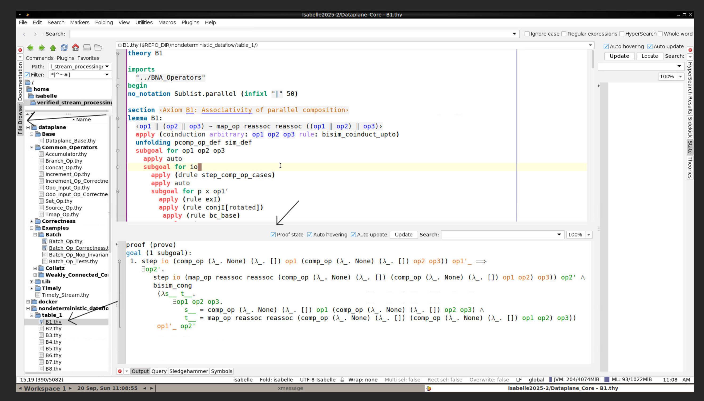

# Verifying Timely Dataflow Programs in Isabelle/HOL

This repository contains the Isabelle/HOL formalization accompanying the PhD
thesis *Verifying Timely Dataflow Programs in Isabelle/HOL*. It covers the
nondeterministic asynchronous dataflow operators, the Timely Dataflow data
plane and its integration with progress tracking, the reasoning infrastructure
for proving programs correct, and the verified case studies.

The names of types, constants and lemmas are the same in the thesis and in the
theories below.

There are several ways to work with it, from reading the proofs in a browser
with nothing installed, to editing the operator algebra itself. The next
section lays them out.

## Ways to use this formalization

The theories are split into four sessions, each building on the previous
one:

    Nondeterministic_Dataflow   the operator algebra, tables 1 to 3
      Dataplane_Base            the AFP entries used further up
        Dataplane_Core          Lib, Timely, Correctness, Common_Operators
          Dataplane             the case studies under Examples/

This layering is what makes the options below differ, together with the two
ways of naming a session to `isabelle jedit`:

- `-l S` loads `S` itself as the logic image. Every theory of `S`, its own
  included, is already in the heap, so opening one re-checks nothing. The
  price is that this is **read only**: the text comes from the session
  database rather than from the prover, and editing a theory invalidates its
  markup.
- `-R S` puts `S`'s own theories on the **editable** source path and takes
  every ancestor from a prebuilt heap image. Opening a theory of `S` re-checks
  it and whatever it imports from within `S`. This is the mode for working on
  proofs, and the further down the chain you open, the less is re-checked.

| What you want to do | How |
|---|---|
| Read the proofs, nothing installed | the container, below |
| Browse and inspect, nothing re-checked, read only | `isabelle jedit -d . -l Dataplane` |
| Work on the case studies | `isabelle jedit -d . -R Dataplane` |
| Work on the data plane and its correctness infrastructure | `isabelle jedit -d . -R Dataplane_Core` |
| Work on the operator algebra | `isabelle jedit -d . -R Nondeterministic_Dataflow` |

Only the first needs no local installation. For every other option, do the
one-time setup under [Running it locally](#running-it-locally) first.

### Reading the proofs in a container

A container image carries Isabelle2025-2, the AFP and this formalization,
already checked, and runs Isabelle/jEdit on a virtual display that it serves
to a web browser. Nothing is installed and nothing is re-checked on your
machine, a browser is all you need.

```
docker run --rm -p 127.0.0.1:6080:6080 --shm-size=2g \
  rafaelcgs10/verified-stream-processing:1.0-amd64
```

Then open <http://localhost:6080/vnc.html> and log in with the password
`isabelle`. Isabelle/jEdit comes up with the `Dataplane` session loaded as
its logic image (`-l Dataplane`), so the whole formalization, the case
studies included, is heap resident and opening a theory re-checks nothing.
Give it a minute to load, then see [Using the Isabelle/jEdit
interface](#using-the-isabellejedit-interface) below for how to open a
theory and inspect a proof.

This is a reading view: the proofs are served from the session databases, and
editing a theory invalidates its markup rather than re-checking it. To edit
the case studies inside the container, start it with
`-e SESSION_ARGS="-R Dataplane"`.

The download is about 2.6 GB. Give the container about 12 GB to 16 GB of
memory. On Docker Desktop raise it under *Settings > Resources > Memory*,
and lower Isabelle's own ceiling to match with `-e ML_MAXHEAP=8G` on a
smaller machine, keeping it at or below 16G.

**On architecture.** The published image is `linux/amd64` only for now. It
runs on Apple Silicon through emulation, but replaying proofs is bound by
the processor and Poly/ML is close to the worst case for an emulator, so
expect it to be slow there. Building the image yourself on an ARM machine
gives a native one.

**Building it yourself.** From the root of this repository:

```
docker build -t verified-stream-processing .
docker run --rm -p 127.0.0.1:6080:6080 --shm-size=2g verified-stream-processing
```

This reproduces the whole check from source. It takes roughly an hour and a
half and needs about 24 GB of memory available to the Docker daemon. The
Dockerfile selects the Isabelle build matching the architecture it is built
on, so on Apple Silicon this produces a native image.

**An archived copy** is deposited with the release as a tarball, for
citation and for use without a registry:

<!-- TODO: add the Zenodo DOI and link once the record is published. -->

```
zstd -d -c verified-stream-processing-1.0-image.tar.zst | docker load
docker run --rm -p 127.0.0.1:6080:6080 --shm-size=2g \
  verified-stream-processing:1.0
```

See [`docker/README.md`](docker/README.md) for the build arguments, the
pinned AFP commit and the memory requirements.

### Running it locally

Every option below needs Isabelle2025-2, the matching AFP release and the
GHC component. The short version:

```
# 1. OS packages, on a minimal Linux system such as a fresh container
apt-get update && apt-get install -y curl unzip ca-certificates fontconfig \
  xz-utils make build-essential libgmp-dev libnuma-dev libncurses-dev zlib1g-dev

# 2. Isabelle2025-2 from https://isabelle.in.tum.de/, with its bin/ on your PATH

# 3. the AFP release for Isabelle2025-2, registered as an Isabelle component
isabelle components -u /path/to/afp/thys

# 4. the GHC component
isabelle ghc_setup

# 5. one full check, which produces the heap images every option below loads
isabelle build -d . -b -v Dataplane
```

Step 4 is required, not optional: several theories evaluate generated code
with `value [GHC]` and the build fails without it. It downloads a Haskell
toolchain on first use.

Step 5 takes a while, about half an hour on a fast machine with enough
memory and a few hours on a slower one. It is what makes the options below
load from prebuilt heaps instead of re-checking. `-b` keeps the heap of
`Dataplane` itself, which the browse mode needs and a plain `isabelle build`
does not produce. Pass `-o timeout_scale=2` if a session times out on a slow
or containerized machine.

See [Requirements](#requirements) for the details behind each step,
including why `fontconfig` matters, the IPv6-only Isabelle download server
and an IPv4 mirror, and which AFP entries are used.

### Browsing and inspecting, with nothing re-checked

```
isabelle build -d . -b -o show_states -v Dataplane
isabelle jedit -d . -l Dataplane -o editor_output_state=true
```

`-l` loads `Dataplane` itself as the logic image, so every theory in the
repository is already in the heap, the case studies included. Use *File >
Open* on any theory, for instance
`dataplane/Examples/Weakly_Connected_Components/Label_Propagation_Op_Correctness.thy`,
and it comes up fully marked up at once. Nothing is replayed, and nothing is
sent to the prover.

The `-b` on the build line is what makes this work: without it the heap of
`Dataplane` itself is not kept, and jEdit rebuilds the whole session on the
first start.

This mode is **read only**. The buffer is reconstructed from the session
database rather than checked by the prover, so as soon as you edit a theory
its markup is dropped and the editor reports changed sources for a loaded
theory. To change a proof, use the developing mode below.

The two options are what make proof states visible, and they are needed at
different times. `-o show_states` on the *build* records a state after every
command in the session database; `-o editor_output_state=true` makes the
*Output* panel display them. Neither is on by default, and the first is the
one that cannot be added afterwards without rebuilding. The separate *State*
panel stays empty either way, since no prover is running behind the buffer.
`show_states` also inflates the databases noticeably, so leave it off if you
only want to read the sources and the markup.

### Developing the case studies

```
isabelle jedit -d . -R Dataplane
```

`-R` puts the theories under `dataplane/Examples/` on the editable source
path, and the whole infrastructure they build on stays in the
`Dataplane_Core` heap. Opening a case study re-checks it and whatever it
imports from within `Examples/`. Nothing outside `Examples/` is replayed.

Imports reaching out of `Examples/` must be written session-qualified, as
`Dataplane_Core.Consumes` rather than `"../../Correctness/Consumes"`.
Isabelle rejects a cross-session import written as a file path.

### Developing the data plane and correctness infrastructure

```
isabelle jedit -d . -R Dataplane_Core
```

Now `dataplane/Lib/`, `dataplane/Timely/`, `dataplane/Correctness/` and
`dataplane/Common_Operators/` are editable, with the AFP entries and the
operator algebra coming from the `Dataplane_Base` heap. The case studies are
not part of this session, so rebuild `Dataplane` afterwards to check that
they still go through.

### Developing the operator algebra

```
isabelle jedit -d . -R Nondeterministic_Dataflow
```

Everything under `nondeterministic_dataflow/`, including the algebra tables,
is editable, and only the AFP sits underneath. The first start may build a
small auxiliary image for the few library theories that are not part of the
`Coinductive` session.

This is the bottom of the chain, so after changing anything here the sessions
above have to be rebuilt before they can be loaded again.

## Requirements

The formalization is checked with **Isabelle2025-2** and the matching release of
the **Archive of Formal Proofs** (AFP). Building it needs about 24 GB of
memory (the ML process alone peaks around 16 GB) and about 9 GB of disk for
Isabelle, the AFP, and the Haskell toolchain.

0. **OS packages.** On a minimal Linux system (for example a fresh Ubuntu
   container), install the following before anything else:

   ```
   apt-get install curl unzip ca-certificates fontconfig xz-utils make \
     build-essential libgmp-dev libnuma-dev libncurses-dev zlib1g-dev
   ```

   Without `fontconfig`, `isabelle build` aborts immediately with
   `Fontconfig head is null`. Without `xz-utils`, `make`, and a C compiler,
   the `isabelle ghc_setup` step below fails. Regular desktop installations
   usually have all of these already.

1. **Isabelle2025-2**, from <https://isabelle.in.tum.de/>.
   Installation instructions for every platform are part of the official
   tutorial: <https://isabelle.in.tum.de/installation.html>.
   After installing, make the `isabelle` executable available on your `PATH`,
   for example by adding the `bin` directory of the installation to it.
   The download server is reachable over IPv6 only. From an IPv4-only network
   (for example a default Docker bridge), download the same archive from an
   official mirror such as
   <https://proofcraft.systems/isabelle/dist/Isabelle2025-2_linux.tar.gz>.

2. **The AFP release for Isabelle2025-2**, from
   <https://www.isa-afp.org/download/>. Register it as an Isabelle component by
   following <https://www.isa-afp.org/help/>, which amounts to

   ```
   isabelle components -u /path/to/afp/thys
   ```

   Installing the complete AFP is recommended. The build uses the entries
   `Coinductive`, `Progress_Tracking`, `DFS_Framework`, `Containers`,
   `Collections`, `Automatic_Refinement` and `Refine_Monadic`, and these pull in
   further AFP entries of their own.

3. **The GHC component**, set up once with

   ```
   isabelle ghc_setup
   ```

   This step is **required**, not optional: several theories evaluate the
   generated code with `value [GHC]`, and the build fails without it. The
   command downloads a Haskell toolchain and needs network access on first use.

## Building

To check the whole formalization in one go, without the editor:

```
isabelle build -d . -b -v Dataplane
```

`-b` keeps the heap image of `Dataplane` itself, which the browse mode above
loads. Without it only the ancestors' heaps are kept, and `isabelle jedit -l
Dataplane` rebuilds the session on its first start.

`Dataplane` is the leaf session, so this builds its ancestors too and ends up
checking every theory in the repository: `Nondeterministic_Dataflow` with the
operator model and the algebra tables, `Dataplane_Base` with the AFP entries
used further up, `Dataplane_Core` with the libraries, the data plane and the
correctness infrastructure, and `Dataplane` itself with the case studies.

Expect about half an hour on a recent machine with enough memory, and a few
hours on a slower one. On a slow or containerized machine, pass
`-o timeout_scale=2` if a session times out.

To work in Isabelle/jEdit rather than batch mode, see
[Ways to use this formalization](#ways-to-use-this-formalization) above,
which explains which session to open for which kind of work.

## Using the Isabelle/jEdit interface

Isabelle/jEdit is the interface for reading and writing proofs. The parts
that matter for inspecting this formalization are marked below.



**Opening a theory.** The *File Browser* dock on the left lists the
repository tree, so a theory is one double click away. *File > Open* works
too. The title bar names the session image in use and the open theory, for
example `Isabelle2025-2/Dataplane_Core - B1.thy`, which is a quick way to
confirm you started the session you meant to.

**Seeing the proof state.** Put the text cursor on any command inside a
proof. The *Output* panel at the bottom then shows the state at that point,
the remaining subgoals and the assumptions in scope. Tick **Proof state**
in that panel, as marked in the picture, or the panel only reports
messages and not the goal. The container ticks it for you, with
`-o editor_output_state=true`. Stepping the cursor from one `apply` to the
next walks the proof one command at a time.

In the browse mode (`-l Dataplane`, what the container starts) the states are
the ones recorded when the session was built, and the separate *State* panel
stays empty, since there is no running prover behind the buffer. The *Output*
panel is the one to use.

**Auto update** keeps the panel in sync with the cursor. With it off, the
panel is refreshed only when you press **Update**, which is useful when you
want to keep one state on screen while looking somewhere else.

**Checking progress.** A theory is checked as it is loaded, and the parts
still being processed are shaded in the text and in the narrow strip beside
the scroll bar. The *Theories* dock on the right lists every theory being
processed and its status. Under `-R S`, opening a theory re-checks it and
what it imports from within `S`, never an ancestor session. Under
`-l S` nothing is processed at all, so these indicators stay quiet.

**Looking things up.** Hovering over a name shows its type and its
definition. Control-click, or Command-click on macOS, jumps to where it is
defined, including into the Isabelle and AFP sources. The *Query* dock
searches for theorems by name or by pattern, and the *Symbols* dock inserts
mathematical notation without needing to remember the ASCII spelling.

**Memory.** The right of the status bar reports JVM and ML heap use. If the
ML figure approaches its limit, give the container more memory and raise
`ML_MAXHEAP`, keeping it at or below 16G.

## Structure

| Directory | Content |
|---|---|
| `nondeterministic_dataflow/` | the nondeterministic asynchronous dataflow operators, together with `table_1/`, `table_2/` and `table_3/`, the proofs of the algebra axioms |
| `dataplane/Timely_Stream.thy` | events, timestamped streams, and their monotonicity properties |
| `dataplane/Lib/` | general purpose libraries, timestamps, antichains, locations, executability |
| `dataplane/Timely/` | the Timely Dataflow data plane: operator states, the dataflow operator, the progress tracker, and the compilation of dataflow trees |
| `dataplane/Correctness/` | the reusable correctness infrastructure: progress, capabilities, collections, and the simulation proof methods |
| `dataplane/Common_Operators/` | reusable operators such as the out-of-order input operator, the increment operator, and the set specification operator |
| `dataplane/Examples/Batch/` | the batch operator and its correctness proof |
| `dataplane/Examples/Collatz/` | the Collatz program, an example with a loop |
| `dataplane/Examples/Weakly_Connected_Components/` | the weakly connected components case study: the label propagation operator, its correctness proof, and an imperative version of the same algorithm verified with the Isabelle Refinement Framework |

The main results are the weak bisimilarity correctness lemmas
`correctness` in `dataplane/Examples/Batch/Batch_Op_Correctness.thy`
and in
`dataplane/Examples/Weakly_Connected_Components/Label_Propagation_Op_Correctness.thy`.

## License

The formalization is distributed under the terms of the `LICENSE` file in this
repository.
